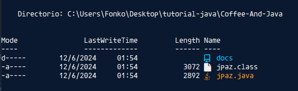
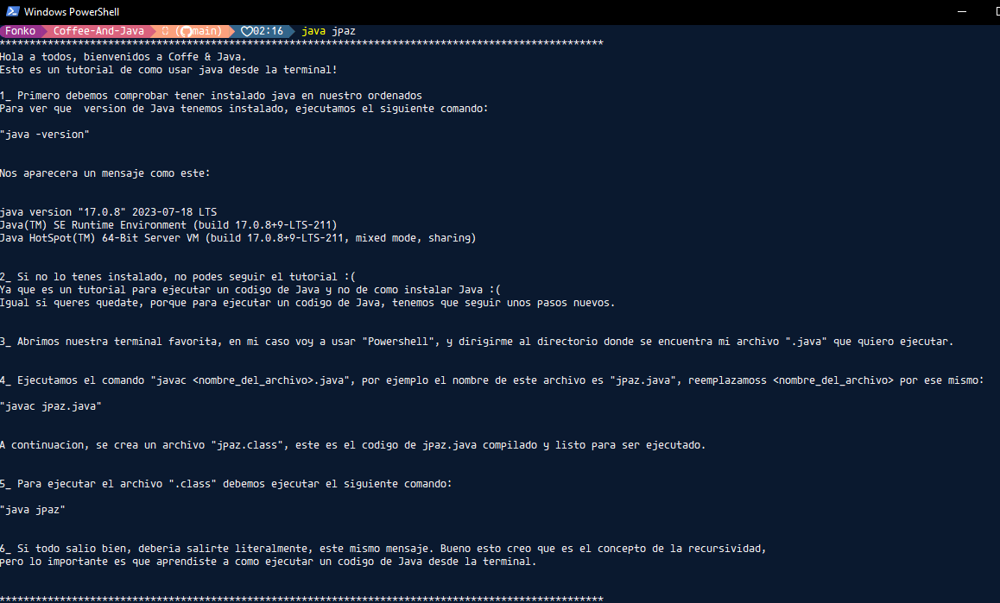

# Tutorial de como ejecutar un codigo de Java desde la terminal

## Atencion!

Para este Tutorial, lo ideal es que tengan instalado `JDK` en nuestro ordenador, si no estas seguro de que tenes instalado el `JDK`, ejecuta el siguiente comando:

```bash
    java -version
```

Si no te sale un mensaje de error, adelante. De lo contrario, te invito a que lo instales viendo el siguiente [tutorial de como instalar JDK](https://www.youtube.com/watch?v=L1oMLsiMusQ&list=PLyvsggKtwbLX9LrDnl1-K6QtYo7m0yXWB), o que mires mi tutorial pero sin la parte didactica :(

---

- Fuente : [La Geekipedia de Ernesto | Curso de Java desde Cero #2](https://www.youtube.com/watch?v=Cs5ymoNkrX8)

---

## Clonar un Repositorio

Primero, nos creamos un nuevo espacio de trabajo y vamos a clonar el siguiente repositorio [`Coffe & Java`](https://github.com/JuanFPaz/Coffee-And-Java):

```bash
    git clone https://github.com/JuanFPaz/Coffee-And-Java.git
```

A continuacion, nos dirigimos a nuestro directorio clonado en la terminal ejecutando el siguiente comando:

```bash
    cd Coffee-And-Java
```

Una vez en nuestro nuevo espacio de trabajo, para ejecutar un codigo de `Java`, deberiamos compilar el archivo [jpaz.java](../jpaz.java) con el siguiente comando:

```bash
    javac jpaz.java
```

Para verificar si nuestro archivo se compilo con exito, ejecutamos el comando `ls` en la terminal, y si aparece el archivo `jpaz.class`, es porque nuestro archivo `.java` fue compilado con exito:



Si todo esta en orden, para finalizar ejecutamos el comando `java jpaz`, y en nuestra terminal de comandos, te vas a encontrar con el siguiente mensaje:



El codigo que ejecutamos recien, es un codigo que imprime por consola, un tutorial de como ejecutar un comando de `Java` (Caiste en un bucle jaja).

Esto fue todo y espero que te haya gustado. Hasta luego.
